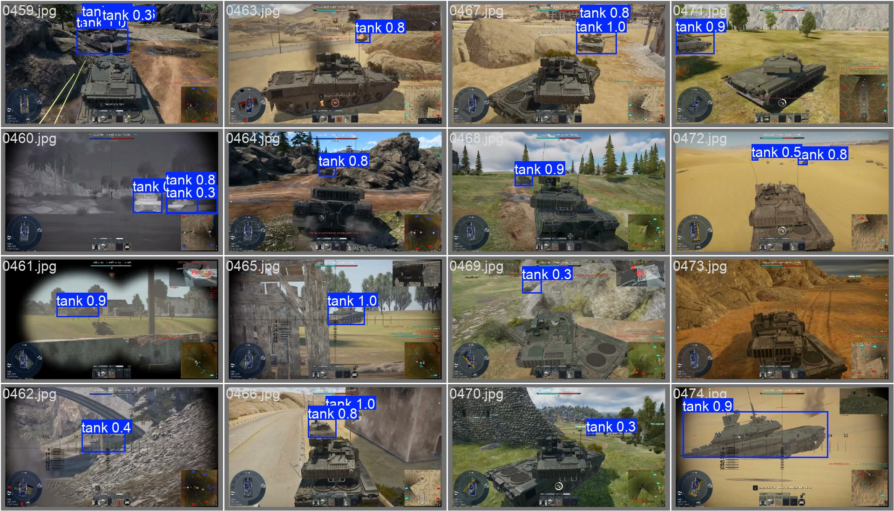

# Tank Object Detection (YOLOv8)

Object detection project for detecting tanks in game footage using YOLOv8.

## Task
Detect tanks in images and videos.

## Model
- YOLOv8n
- Ultralytics
- PyTorch

## Dataset
- Custom dataset in YOLO format
- Images collected from gameplay footage
- Single class: tank
- Train / Test
- this dataset - https://www.kaggle.com/datasets/ualikazbek/tank-detection-yolo

## Training
yolo detect train model=yolov8n.pt data=data.yaml imgsz=640 epochs=50 batch=16 workers=0

## Results
epoch,mAP50-95,mAP50,precision,recall \
50,0.49257,0.79642,0.85242,0.75497

# Inference (Image)
yolo predict model=best.pt source=image.jpg conf=0.25

# Inference (Video)
yolo predict model=best.pt source=video.mp4 conf=0.25
