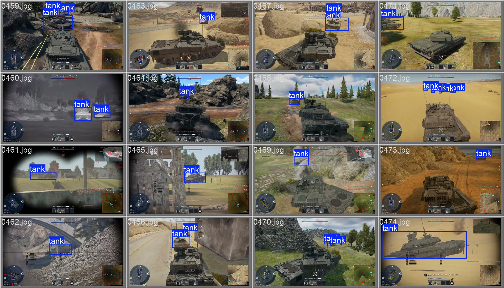

# Tank Object Detection (YOLOv8)

Object detection project for detecting tanks in game footage using YOLOv8.

## Task
Detect tanks in images and videos.

## Model
- YOLOv8n
- Ultralytics
- PyTorch

## Dataset
- Custom dataset in YOLO format
- Images collected from gameplay footage
- Single class: tank
- Train / Test
- this dataset - https://www.kaggle.com/datasets/ualikazbek/tank-detection-yolo

## Training
yolo detect train model=yolov8n.pt data=data.yaml imgsz=640 epochs=50 batch=16 workers=0

## Results
epoch,time,train/box_loss,train/cls_loss,train/dfl_loss,metrics/precision(B),metrics/recall(B),metrics/mAP50(B),metrics/mAP50-95(B),val/box_loss,val/cls_loss,val/dfl_loss,lr/pg0,lr/pg1,lr/pg2,lr/pg3,lr/pg4,lr/pg5,lr/pg6,lr/pg7
50,360.573,0.92477,0.65446,0.92701,0.85242,0.75497,0.79642,0.49257,1.44269,0.94533,1.16448,0.0001788,5.96e-05,0.0001788,5.96e-05,0.0001788,5.96e-05,0.0001788,5.96e-05

# Inference (Image)
yolo predict model=best.pt source=image.jpg conf=0.25

# Inference (Video)
yolo predict model=best.pt source=video.mp4 conf=0.25
